# HELLO WORLD I'm Marwan 👋

### Find Me Here

### **Tech Stack**

**Languages:**  
     

**Editors/IDEs:**  
   

**Tools:**  
 

---

## GitHub Stats

  
  
  

---

- 💻 I’m currently working on: **Game of Life**
- 📖 I'm currently reading: **No Longer Human**
- 🎓 I’m currently studying at: **The University of Hull**
- 🎮 Ask me about: **Fear and Hunger lore**
- ✉️ How to reach me: Email me (Found on portfolio website)
- 👤 Pronouns: **He/Him**
